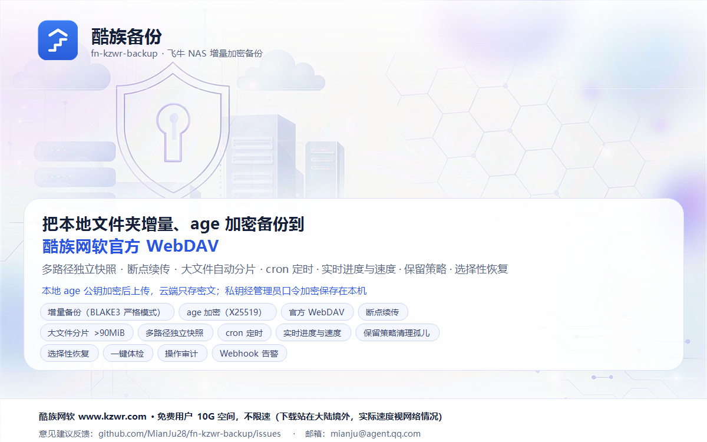

# 酷族备份 — 飞牛 NAS 增量加密备份

把飞牛 NAS 上的文件夹**增量、加密**备份到[酷族网软](https://www.kzwr.com)云盘，支持按文件/目录选择性恢复，全程在飞牛桌面里操作。

> 备份内容在**本机用 age 公钥加密后**才上传，云盘只存密文；恢复时用私钥解密。明文与私钥都不会离开你的 NAS。



## ✨ 能做什么

- **增量备份**：只传变化的文件（比对修改时间与大小），可选内容哈希严格核对
- **加密上传**：age 公钥加密，云盘只存密文；**全程流式，明文不落盘**
- **断点续传**：中断后从断点继续，不必重传
- **多目录备份**：多个源文件夹各自独立记录，在云盘按**源文件夹名**分目录存放
- **多目标 · 多任务**：可配多个备份账号（异地/多账号容灾），每个组合「源文件夹 + 目标 + 定时 + 保留策略」；某个目标异常不影响其它任务
- **大文件自动分片**：超过 90MiB 自动拆分上传，规避站点单文件 100MB 限制
- **定时备份**：cron 表达式定时触发，改动即预览接下来 5 次运行时间（按 NAS 本地时区）
- **选择性恢复**：树形浏览云端备份，按文件或整个目录恢复；恢复后下次备份**不会重复上传**
- **保留策略**：备份后自动清理云端多余文件，防止空间膨胀；可选按占用/时间门槛清空回收站
- **实时进度**：展示 准备 → 传输 → 收尾 全流程，含速度、已传量、剩余时间
- **空间预警与账号信息**（可选）：填写酷族 access-token 后可查看存储空间与账号详情
- **一键体检**：逐项检查连通性、私钥备份、备份路径与定时任务，并给出修复建议
- **操作审计**：凭据变更、密钥导出、配置导入、备份/恢复等操作本地留痕
- **配置导入/导出**：一键导出/导入全部设置，便于重装或换机
- **失败告警**：备份/恢复失败在应用内提醒，可选外发到 Webhook（支持自定义请求头与模板）

## 📥 安装

**要求**：飞牛 fnOS ≥ 1.2.0，x86_64 设备。

1. 从 [Releases](https://github.com/MianJu28/fn-kzwr-backup/releases) 下载最新的 `fn-kzwr-backup.fpk`
2. 在飞牛「应用中心 → 手动安装」选择该文件
3. 安装向导会让你设置一个**管理员口令** —— 它用于加密配置与备份私钥，做敏感操作时会要求输入，请牢记
4. 安装完成后，从飞牛桌面打开「酷族备份」

> **安装后第一件事**：去「设置」页**导出并保存私钥**。私钥是恢复数据的唯一凭据，丢失后已备份的数据无法解密。

> 应用**不占用任何端口**：页面通过飞牛统一网关访问（`https://<你的NAS>/app/fn-kzwr-backup`）。

## 🚀 开始使用

### 1. 配置备份目标

打开「**目标**」页 → 新建目标 → 类型选 `WebDAV`：

| 字段 | 填什么 |
|---|---|
| 地址 | 留空即用官方默认 `https://dav.kzwr.com/dav` |
| 账号 | 你的酷族用户名 / 邮箱 |
| 应用密码 | 在[酷族官网](https://www.kzwr.com)创建**应用密码**后填入（建议选「永不过期」与读写权限） |

保存前会自动实测一次连通性。

> 凭据会加密存储在本机，且**永不回传前端**。目标可以配多个（不同账号），供不同任务使用。

### 2. 创建备份任务

打开「**任务**」页 → 新建任务：

- **源文件夹**：点「选择目录」从 NAS 里挑选（也可直接输入路径），可添加多个
- **目标**：选择上一步配置的目标
- **目标文件夹**：云端的存放前缀（如 `fn-backup`），不同任务可用不同目录区分
- **定时备份**（可选）：填 cron 表达式，例如 `0 2 * * *` 表示每天凌晨 2 点
- **保留策略**（可选）：是否清理云端多余文件

保存后点「立即备份」即可验证，进度在概览页右侧实时面板查看。

> 首次选择目录时，飞牛会请求**目录访问授权**，按提示允许即可。

### 3. 恢复文件

打开「**恢复**」页 → 选择备份文件夹 → 展开目录树 → 对文件或整个目录点恢复。

> 恢复完成后会自动记录快照，因此**下次备份不会把这些文件重复上传**。

### 4. 保护好你的私钥

「设置」页可**显示并导出私钥**（需管理员口令校验）。请妥善保存：

- 私钥是恢复数据的**唯一凭据**，丢失后**无法**解密已备份的内容
- 未确认备份时，应用会持续提示风险
- 也可以自定义导入已有的 age 私钥

## 📱 界面导览

| 页面 | 用途 |
|---|---|
| **概览** | 一键体检 + 按任务/目标聚合的备份统计，右侧常驻实时任务面板 |
| **任务** | 备份任务的增删改、立即备份、启用/停用 |
| **目标** | 备份目标的增删改、连通性测试 |
| **插件** | 增强功能（如酷族空间信息）与插件管理 |
| **恢复** | 浏览云端备份并选择性恢复 |
| **设置** | age 密钥、通知、配置导入导出 |
| **审计** | 敏感操作留痕 |
| **日志** | 运行日志查看/清空/下载，可开调试日志 |

## 🔐 安全说明

- **端到端加密**：文件在本机用 age 公钥加密后才上传，云盘只存密文
- **私钥保护**：私钥以管理员口令派生密钥加密存储（`keystore.age`，权限 0600），**永不明文落盘**
- **凭据保护**：WebDAV 账号密码加密存储，**永不回传前端**
- **敏感操作**：导出私钥、配置导入导出等需校验管理员口令
- **插件沙箱**：插件运行在受限沙箱中，读不到密钥库、主口令与宿主配置目录

> **请注意**：权限功能（如插件）与主程序运行在**同一进程**内。沙箱能挡住磁盘上的密钥与口令，
> 但无法阻止同进程内的内存读取 —— 因此**请只安装你信任的插件**。

> **忘记管理员口令**：口令保存在应用的配置目录里（文件权限仅限应用自身读取），
> 日常备份与恢复**不需要**每次输入 —— 它只在导出私钥、导入导出配置等敏感操作时校验。
> 若确实遗忘，可由有 NAS 权限的管理员取回；实在无法取回时才需重装并重新配置。

> **真正不可替代的是私钥**：它是恢复数据的唯一凭据。请用「设置」页导出并妥善保存
> （可导出到 NAS 之外的介质）。**私钥丢失后，已备份的数据无法解密。**

## 📄 文档

- [`docs/ARCHITECTURE.md`](docs/ARCHITECTURE.md) — 架构设计（含安全模型与插件机制）
- [`docs/PLUGIN_ABI.md`](docs/PLUGIN_ABI.md) — 插件开发接口契约

## 🛠️ 开发与构建

<details>
<summary>展开：从源码构建</summary>

**依赖**：Rust、Node.js 20+

```bash
# 后端
cd backend && cargo build --release

# 前端
cd frontend && npm install && npm run build
```

**开发期运行**：

```bash
export TRIM_PKGVAR=$HOME/rf-var      # 数据目录（快照/密钥库）
export TRIM_PKGETC=$HOME/rf-cfg      # 配置目录（config.toml）
export TRIM_PASSPHRASE=your-pass     # 管理员口令
export TRIM_WWW_DIR=frontend/dist    # 前端产物
export TRIM_APP_SOCK=/tmp/fn-kzwr-backup.sock
./target/release/fn-kzwr-backup
```

调试时可设 `FN_KZWR_DEBUG_PORT=8098` 临时开本地端口（生产不设置）。

**打包 `.fpk`**：`Scripts/build_fnos_app.sh`（组装应用包 + 构建并签名插件）→ 产物在 `dist/`。

仓库约定：二进制产物（`dist/`、`*.fpk`）与签名私钥 `Scripts/keys/sign.key` **一律不入库**，
分发走 Releases / CI 制品。

</details>

## 💬 反馈

- 问题与建议：[GitHub Issues](https://github.com/MianJu28/fn-kzwr-backup/issues)
- 邮箱：mianju@agent.qq.com

> **酷族网软**：官网 [www.kzwr.com](https://www.kzwr.com)。免费用户提供 10G 空间、不限速，
> 但下载站位于大陆境外，实际速度取决于你的网络情况。
